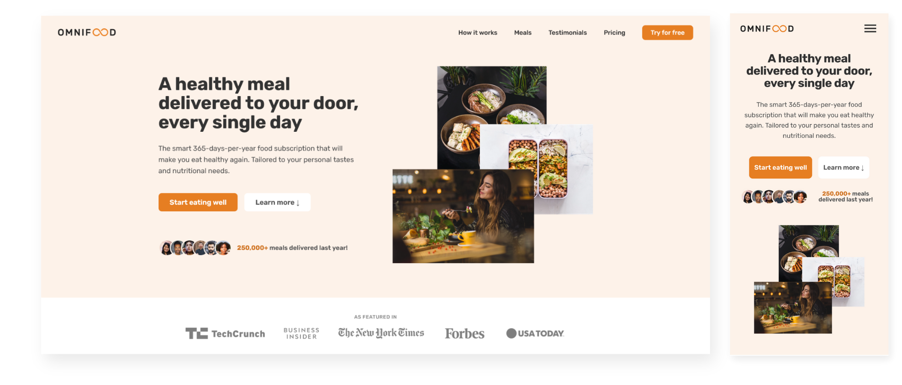
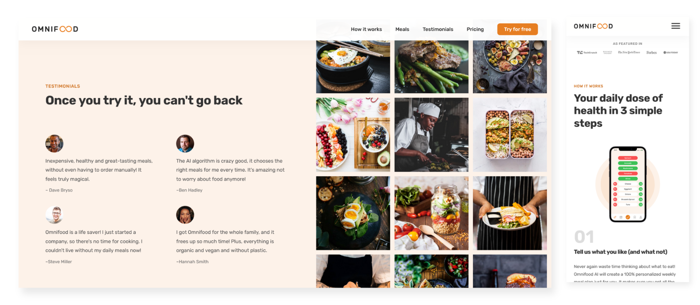
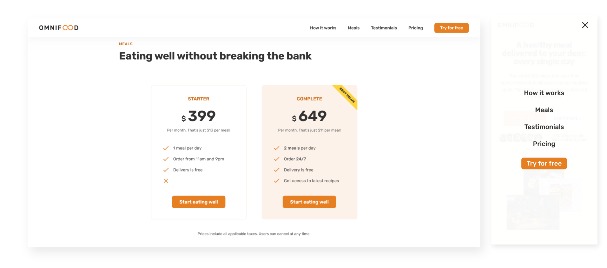

# Omnifood - Static Website

## Overview

This repository contains the static website for Omnifood, an imaginary app designed to revolutionize meal planning and delivery. The website showcases my proficiency in working with HTML, CSS, and JavaScript to create a visually appealing and responsive user interface.
Explore the live demo of the Omnifood website by visiting [Omnifood Live Demo](https://omnifood-peter-nady.netlify.app/).

## Technologies Used

- **HTML:** The structure of the website is built using HTML, ensuring semantic and accessible markup.

- **CSS:** The website is fully styled using CSS, demonstrating a keen understanding of design principles and aesthetics. The use of shades and tints of the primary color follows the upbeat and modern design style.

- **JavaScript:** Minimal JavaScript is employed to enhance user interactions and functionality where necessary.

## Responsive Design

The website embraces a "desktop-first" design approach, ensuring a seamless and visually pleasing experience on larger screens. To achieve responsiveness, media queries are strategically implemented at the following breakpoints:

- 1334px
- 1200px
- 940px
- 700px
- 500px

This approach allows the website to adapt gracefully to various screen sizes and devices, showcasing the ability to create a user-friendly experience across the spectrum of devices.

## Screenshots





## Design Process

The design of the website originated from a Figma prototype, providing a clear vision for the layout, color scheme, and overall user experience. The choice of a single color and its shades/tints aligns with the upbeat and modern design style, creating a cohesive and visually appealing aesthetic.

## How to Use

### Option 1: Clone and Open Locally

1. **Clone the Repository:**

   ```bash
   git clone https://github.com/peternadykamal/Omnifood.git
   ```

2. **Navigate to the Project Directory:**

   ```bash
   cd omnifood
   ```

3. **Open in Browser:**
   - Find the `index.html` file in the project directory.
   - Open it using your preferred web browser.

### Option 2: View Live Demo

Explore the live demo of the Omnifood website by visiting [Omnifood Demo](https://omnifood-peter-nady.netlify.app/). This allows you to experience the website without the need for local setup or cloning.

## Feedback and Contributions

If you have any feedback, suggestions, or would like to contribute to Forkify, please open an issue or submit a pull request on the [GitHub repository](https://github.com/peternadykamal/Omnifood.git).
